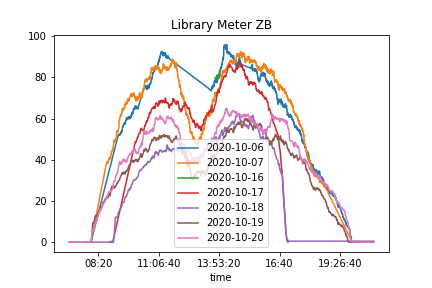

Library Meter ZB
================

This small scraper aims to account for the amount of people who are at the [ZB](https://www.zb.uzh.ch/) at a given day and time.

Data
----

The data is interpolated linearly in times where there are no measurements.



Usage
-----

With docker the following command is enough to build and run the container. The scraping is started automatically and the data will be saved in the folder `zb-library-data`.

```sh
sh init_docker.sh
```